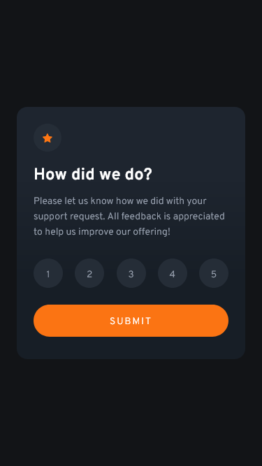
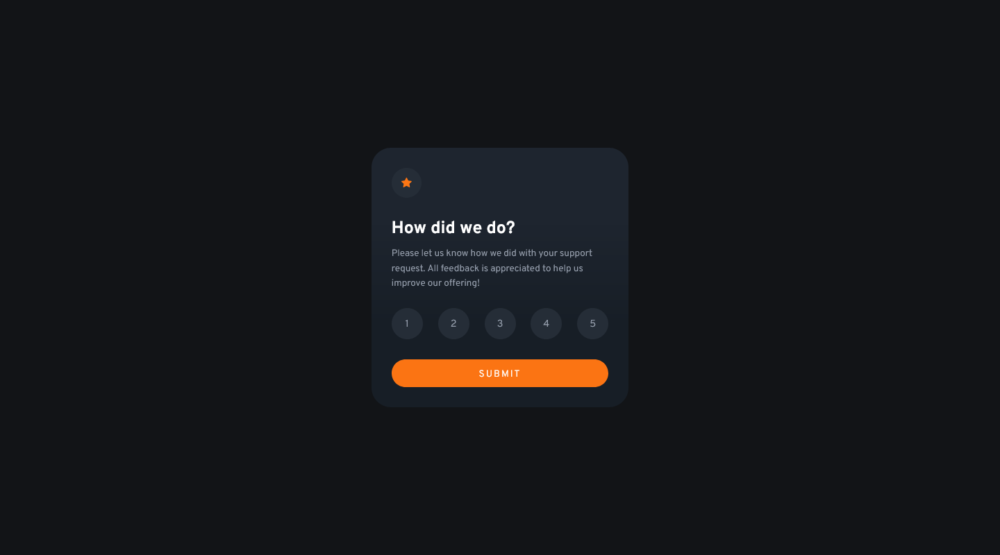

# Frontend Mentor - Interactive rating component solution

This is a solution to the [Interactive rating component challenge on Frontend Mentor](https://www.frontendmentor.io/challenges/interactive-rating-component-koxpeBUmI). Frontend Mentor challenges help you improve your coding skills by building realistic projects. 

## Table of contents

- [Overview](#overview)
  - [The challenge](#the-challenge)
  - [Screenshot](#screenshot)
  - [Links](#links)
- [My process](#my-process)
  - [Built with](#built-with)
  - [What I learned](#what-i-learned)
  - [Useful resources](#useful-resources)
- [Author](#author)

## Overview

### The challenge

Users should be able to:

- View the optimal layout for the app depending on their device's screen size
- See hover states for all interactive elements on the page
- Select and submit a number rating
- See the "Thank you" card state after submitting a rating

### Screenshot




### Links

- Solution URL: [Solution](#)
- Live Site URL: [Live Demo](#)

## My process

### Built with

- Semantic HTML5 markup
- CSS custom properties
- Flexbox
- CSS Grid
- Mobile-first workflow
- CSS Vendor Prefixes

### What I learned

In this project I learned to used `focus` and `blur` javaScript events.

The `focus` event fires when an element has received focus.

The `blur` event fires when an element has lost focus.

To see how you can add code snippets, see below:

```js
ranks.forEach(rank => {
  rank.addEventListener("focus", focusFunc)
  rank.addEventListener("blur", blurFunc)
})
```

### Useful resources

- [MDN](https://developer.mozilla.org/en-US/docs/Web/API/Element/focus_event) - This helped me for use `focus` javaScript event.
- [MDN](https://developer.mozilla.org/en-US/docs/Web/API/Element/blur_event) - This helped me for use `blur` javaScript event.

## Author

- Frontend Mentor - [@James-alderson](https://www.frontendmentor.io/profile/James-alderson)
